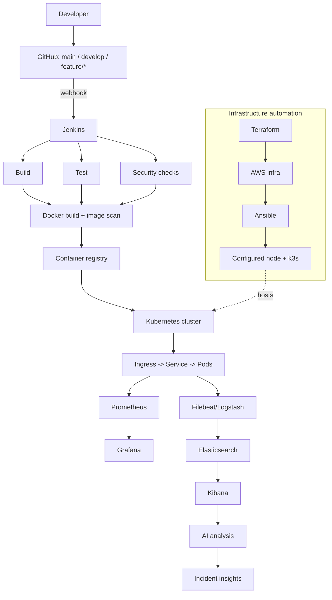
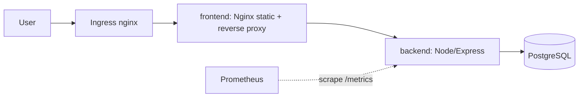

# Architecture

This repository implements the platform described in *Davine Technologies - AI-Powered E-Commerce DevOps & Cloud-Native Delivery Platform: Project Implementation & Architecture Report*. Section numbers below refer to that report.

## Layers (report s.6)

## Runtime topology

* **frontend** serves static files and reverse-proxies `/api`, `/health`, `/ready` to the backend (s.10). `/metrics` is deliberately not exposed through it.
* **backend** exposes `/health` (liveness), `/ready` (checks the database), `/metrics` (Prometheus) and writes JSON logs to stdout (s.4 "health endpoints", "application logs").
* **PostgreSQL** is on an internal-only network (Compose) / protected by a NetworkPolicy (Kubernetes).

## Key decisions

| Decision | Reason |
|---|---|
| Small reference app instead of "the existing app" | The report says the application is pre-existing but none was supplied. The DevOps layers only depend on its contract (ports, health endpoints, env vars, JSON logs), so a real app can replace it. |
| k3s on one EC2 node (not EKS) | Cheap and fast to demonstrate the full Terraform -> Ansible -> Kubernetes chain. Swap `modules/compute` for an EKS module for a managed cluster. |
| Rolling updates via `helm upgrade --atomic` | Matches the report's primary strategy and gives automatic rollback if readiness never succeeds. |
| Security gates fail closed | A missing scanner (e.g. no Trivy) fails the stage instead of silently passing. |
| AI is advisory only | The analyzer suggests; it never executes. Logs are redacted before leaving the machine and treated as untrusted input. |
